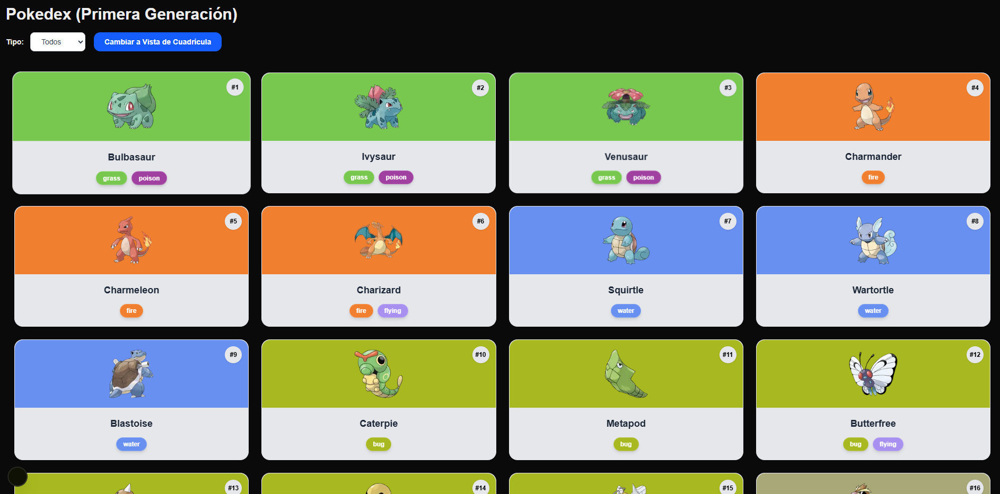
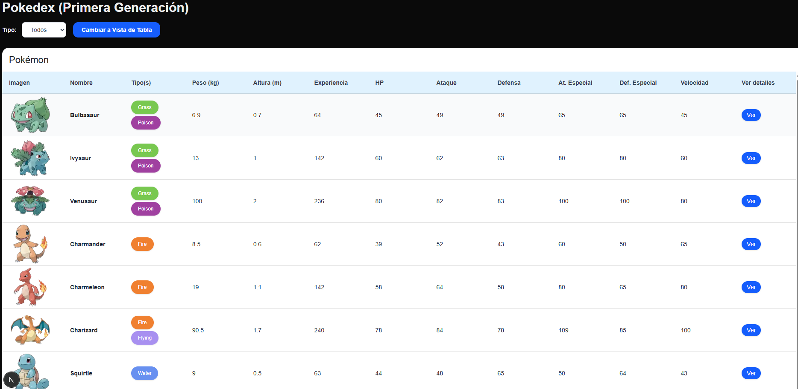

# 🧿 Pokedéx App (Primera Generación)

Aplicación web construida con **Next.js + TypeScript + Tailwind CSS** que muestra todos los Pokémon de la primera generación. Permite:

- Ver los Pokémon en formato de **cuadrícula** o **tabla**
- **Filtrar** por tipo
- Ver **estadísticas completas** y detalles en un modal

---

## 🖼️ Capturas de pantalla

### 📦 Vista de Cuadrícula


### 🧾 Vista de Tabla


---

## 🚀 Demo

👉 [Ver la demo en netlifyl](https://pokemonappweb.netlify.app/)  

---

## 🛠️ Tecnologías utilizadas

- [Next.js](https://nextjs.org/)
- [TypeScript](https://www.typescriptlang.org/)
- [Tailwind CSS](https://tailwindcss.com/)
- [PokéAPI](https://pokeapi.co/)

---

## 📦 Cómo correr el proyecto localmente

1. **Clona este repositorio**

```bash
git clone https://github.com/tuusuario/pokedex-app.git

cd pokedex-app

npm install

npm run dev
    o
yarn run dev
